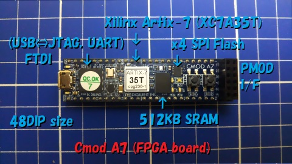
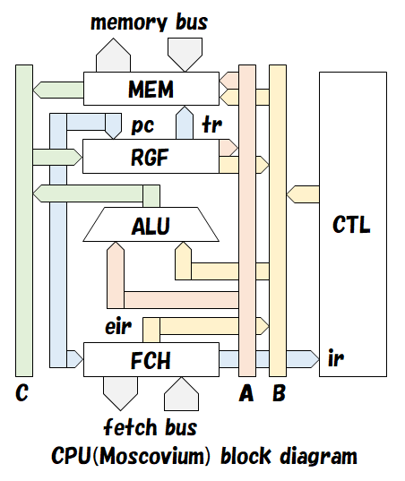
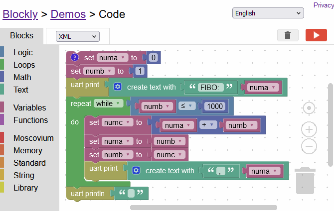

--------
# MCOC115-VD<!-- Moscovium series MCU project for Xilinx Vivado -->
 This is Moscovium series MCU project for Digilent Cmod A7 FPGA board.

- Xilinx Vivado (v2024.2) project
	- Target: Xilinx Artix-7 family XC7A35T FPGA chip on the Cmod A7 FPGA board
- MCOC: Moscovium (Mc) On Chip
	- 115 is the atomic number of Mc (Moscovium).
	- 117 for Ts (Tennessine), 113 for Nh (Nihonium).

## Moscovium series
 Moscovium is an original 16 bit CPU core.

 More options for the Moscovium series here:

1. Tennessine
	- 8 bit data path
2. Moscovium-BS
	- 16 bit data path
	- [Blockly Slim](http://hello.world.coocan.jp/ARDUINO33/arduino33_3.html#MCBS)
3. Moscovium
	- 16 bit data path
4. Moscovium-SS
	- 16 bit data path x2
	- [Super Scalar](http://hello.world.coocan.jp/ARDUINO/index.html#RI_SPRSCL)
5. Nihonium
	- 32 bit data path
6. Nihonium-SS
	- 32 bit data path x2
	- [Super Scalar](http://hello.world.coocan.jp/ARDUINO20/arduino20_8.html#NHSS)

- The order listed above is roughly a trade-off between performance and size (LUTs).
	- Lower performance takes smaller size.
	- Higher performance takes larger size.
- Moscovium series CPU cores are scalable from 8 ~ 32 bit data paths.
	- They share the same instruction code.
	- They are upward or downward compatible instruction sets, each other.
- SMP and AMP dual core CPU edition available.
	- [SMP](http://hello.world.coocan.jp/ARDUINO17/arduino17_1.html) (Symmetric Multi-Processing)
	- [AMP](http://hello.world.coocan.jp/ARDUINO29/arduino29_6.html) (Asymmetric Multi-Processing)
	- Moscovium / Moscovium-SS / Nihonium / Nihonium-SS can be selected as SMP and AMP main CPU.
	- Moscovium / Tennessine can be selected as AMP sub CPU.

## Development of software
 Moscovium series MCU can be developed using an assembler or Blockly.

- Macro assembler: [asm_mcvm.olv](asm/asm_mcvm.olv)
	- A script of [Olive+](http://hp.vector.co.jp/authors/VA008835/OLIVE+/Olive+.html).
	- You need install Olive+ on your Windows PC.
	- Olive+ can be download from [here](http://www.vector.co.jp/soft/winnt/art/se437034.html).

- [Blockly for Moscovium](http://hello.world.coocan.jp/ARDUINO31/a316_blky2mcvm.html#MANTOP)
	- Block base visual programming environment.
	
	- Build up blocks to control MCU.
	- Download program code in XML format, and translate it to Moscovium assembler source list.

- Blockly.XML to Moscovium.ASM translator: [blky2mcvm.olv](blky/blky2mcvm.olv)
	- A script of [Olive+](http://hp.vector.co.jp/authors/VA008835/OLIVE+/Olive+.html).
	- You need install Olive+ on your Windows PC.
	- Olive+ can be download from [here](http://www.vector.co.jp/soft/winnt/art/se437034.html).

--------
# Directories and Files

- README.md
	- This article.
- Xilinx Vivado's project directory
	- asm/
		- Macro assembler and sample sources
	- blky/
		- Blockly.XML to Moscovium.ASM translator and sample sources
	- img/
		- images
	- ip/
		- IP units
	- mcu/
		- Common RTL modules
	- sim/
		- Test bench for logic simulation
	- top/
		- Top level definition modules
	- MCOC115.srcs/
		- Other sources
	- MCOC115.xpr
		- Vivado project file template

--------
# IP Units
 See [MCU edition table](http://hello.world.coocan.jp/ARDUINO27/a274_edition.png) first.

 All links point to Japanese pages.

## CPU core
- [Moscovium](http://hello.world.coocan.jp/ARDUINO/index.html#RI_MCVM)
	- Original 16 bit CPU core
- [Nihonium](http://hello.world.coocan.jp/ARDUINO20/arduino20_4.html)
	- Original 32 bit CPU core
- [Tennessine](http://hello.world.coocan.jp/ARDUINO26/arduino26_3.html#TNSNDSGN)
	- Original 8 bit CPU core
- [Moscovium-BS](http://hello.world.coocan.jp/ARDUINO33/arduino33_3.html)
	- Original 16 bit CPU core
	- [Blockly Slim](http://hello.world.coocan.jp/ARDUINO33/arduino33_3.html#MCBS)
- [Moscovium-SS](http://hello.world.coocan.jp/ARDUINO21/arduino21_3.html#CPUMTRX)
	- Original 16 bit CPU core
	- [Super Scalar](http://hello.world.coocan.jp/ARDUINO/index.html#RI_SPRSCL) edition
- [Nihonium-SS](http://hello.world.coocan.jp/ARDUINO20/arduino20_8.html#NHSS)
	- Original 32 bit CPU core
	- [Super Scalar](http://hello.world.coocan.jp/ARDUINO20/arduino20_8.html#NHSS) edition

## Co-processor
- [MULC16](http://hello.world.coocan.jp/ARDUINO16/arduino16_2.html#FLSHMUL)
	- Multiply co-processor
		- for Moscovium / Moscovium-BS / Moscovium-SS
	- 16 * 16 = 32 bit multiply, signed and unsigned
- [DIVC16](http://hello.world.coocan.jp/ARDUINO33/arduino33_4.html#DIVC16)
	- Divide co-processor (step divider)
		- for Moscovium-BS
	- 16 / 16 = 16 ... 16 bit divide, signed and unsigned
- [DIVC32](http://hello.world.coocan.jp/ARDUINO16/arduino16_3.html#HYBDIV)
	- Divide co-processor (flush / step hybrid divider)
		- for Moscovium / Moscovium-SS
	- 16 / 16 = 16 ... 16 bit divide, signed and unsigned
	- 32 / 32 = 32 ... 32 bit divide, signed and unsigned
- [H-FPU](http://hello.world.coocan.jp/ARDUINO16/arduino16_5.html)
	- 16 bit Half precision Floating Point Unit (FPU)
		- for Moscovium / Moscovium-BS / Moscovium-SS / Nihonium / Nihonium-SS
- [S-FPU](http://hello.world.coocan.jp/ARDUINO24/arduino24_5.html)
	- 32 bit Single precision Floating Point Unit (FPU)
		- for Nihonium / Nihonium-SS

## System units
- [SYSCA7](http://hello.world.coocan.jp/ARDUINO27/arduino27_3.html#SYSCA7)
	- System controller
- [BUSC2040DL](http://hello.world.coocan.jp/ARDUINO17/arduino17_1.html#DUALBUSC)
	- Bus state controller
	- 16 / 24 bit address area
	- 16 / 32 bit data bus
	- Dual core ready
- [INTC322DVL](http://hello.world.coocan.jp/ARDUINO23/arduino23_2.html#INTC322DVL)
	- Interrupt controller
	- Vector interrupt
	- 4 level interrupt
	- Dual core ready

## Timer units
- [SYSTIM](http://hello.world.coocan.jp/ARDUINO15/arduino15_7.html#MCOCSYTM)
	- System timer unit
	- Millisecond, microsecond and clock counter
- [TIM162](http://hello.world.coocan.jp/ARDUINO15/arduino15_a.html#TIM16)
	- General purpose 16 bit timer unit
	- 16 bit timer counter
	- 16 bit prescaler
	- 2 PWM output
- [TIMLED5](http://hello.world.coocan.jp/ARDUINO27/arduino27_3.html#TIMLED5)
	- LED PWM timer unit
	- 5 PWM output, duty resolution 0 ~ 255
<!--
- [RTC400](http://hello.world.coocan.jp/ARDUINO22/arduino22_a.html#RTC400)
	- Real time clock unit
	- Full 400 years of leap year support
-->

## Communication units
- [UART8N1](http://hello.world.coocan.jp/ARDUINO15/arduino15_7.html#MCOCUART)
	- UART unit
	- Format: 8N1 (8 bit data, no parity, 1 stop bit)
	- [Communication speed detection](http://hello.world.coocan.jp/ARDUINO18/arduino18_8.html)
	- Receive data buffer: 64 byte [FIFO](http://hello.world.coocan.jp/ARDUINO27/arduino27_6.html)
- [STWSER](http://hello.world.coocan.jp/ARDUINO17/arduino17_5.html#STWSER)
	- Synchronous two wire serial unit (I2C)
	- Communication speed: up to 400kHz (Fast mode)
	- Master and slave communication

## I/O units
- [PORT8I8O](http://hello.world.coocan.jp/ARDUINO15/arduino15_7.html#MCOCPORT)
	- General purpose I/O port unit
- [IOMEM16](http://hello.world.coocan.jp/ARDUINO24/arduino24_9.html#IOMEM16)
	- 16 byte I/O memory (RAM) unit
- [SEMPH5R9U](http://hello.world.coocan.jp/ARDUINO17/arduino17_2.html#SEMPH5R12U)
	- Semaphore unit
	- Hardware RAM semaphore * 5 channel
	- User semaphore * 12 channel
- [ICFF16](http://hello.world.coocan.jp/ARDUINO17/arduino17_3.html#ICFF16)
	- Intercommunication FIFO unit
	- Transfer data buffer: 16 bit * 64 word * 2 direction [FIFO](http://hello.world.coocan.jp/ARDUINO27/arduino27_6.html)
- [FONTJP](http://hello.world.coocan.jp/ARDUINO18/arduino18_4.html#FONTJP)
	- Japanese font unit
	- Font [ROM data](http://hello.world.coocan.jp/ARDUINO18/arduino18_4.html#MISAKI)
- [UNISJI](http://hello.world.coocan.jp/ARDUINO22/arduino22_1.html#UNISJI)
	- Unicode and S-JIS conversion unit
	- Conversion table [ROM data](http://hello.world.coocan.jp/ARDUINO21/arduino21_a.html#LUTMIF)
- [DISTUS](http://hello.world.coocan.jp/ARDUINO22/arduino22_4.html#DISTUS)
	- Distance measuring by ultrasonic sensor unit
- [ADCX122](http://hello.world.coocan.jp/ARDUINO28/arduino28_8.html#ADCX122)
	- 12 bit SAR A/D converter unit
	- Xilinx Artix-7 XADC hard macro
- [DAC121](http://hello.world.coocan.jp/ARDUINO24/arduino24_2.html#DAC121)
	- 12 bit delta-sigma D/A converter unit
- [CAM7670](http://hello.world.coocan.jp/ARDUINO30/arduino30_7.html#CAM7670)
	- OV7670 camera I/F unit
	- VGA size (640x480[dot])
	- RGB222 pixel format (64 colors)
- [STFT61](http://hello.world.coocan.jp/ARDUINO33/arduino33_1.html#STFT61)
	- SPI-TFT (ST7735R) controller unit
	- I/O port for software SPI * 6
		- SS, SCLK, MOSI, MISO
		- Reset, Strobe, etc.
	- PWM output for back light LED * 1
		- Tpwm=192*255/fcpu
<!--
- [LOGA8CH](http://hello.world.coocan.jp/ARDUINO16/arduino16_4.html#LOGA8CH)
	- Logic analyzer accelerator unit
-->

## Memory units
- [ROM](http://hello.world.coocan.jp/ARDUINO27/arduino27_8.html#ROM)
	- Instruction ROM unit
	- Boot loader ROM included
- [I-RAM](http://hello.world.coocan.jp/ARDUINO27/arduino27_8.html#IRAM)
	- Instruction RAM unit
- [RAM](http://hello.world.coocan.jp/ARDUINO27/arduino27_8.html#MAINMEM)
	- Main memory (RAM) unit
- [E-RAM](http://hello.world.coocan.jp/ARDUINO28/arduino28_2.html#CA7MMAP)
	- Extended memory (RAM) unit
	- Over 64KB RAM in 24 bit extended address area
- [SRAM512K](http://hello.world.coocan.jp/ARDUINO28/arduino28_6.html#SRAMC512K)
	- External SRAM chip I/F unit
	- 512KB, 8 bit SRAM on the Cmod A7 board

--------
# Configure MCU
 The following shows how to build an MCU from a project template \(MCOC115.xpr\).

1. Select the desired model name.
	- See [MCU edition table](http://hello.world.coocan.jp/ARDUINO27/a274_edition.png).
	- Decide a model name.
		- eg) mcoc115ac0408, etc.
2. Open a project template "MCOC115.xpr" by Xilinx Vivado.
3. See "Sources => Non-module Files".
	- eg) Select "mcoc115ac0408.vh".
4. "Right click => Set Global Include"
	- eg) "mcoc115ac0408.vh" shows a globe icon.
5. "Right click => Clear Global Include"
	- eg) When the globe icon is displayed other than "mcoc115ac0408.vh".
6. "Right click => Set as top"
	- eg) If mcoc115ca0408 does not have a top module icon.
7. Done.
	- "Run Simulation"
	- "Generate Bitstream"
	- and so on.

--------
# Download
 Select "<>Code => Local => Download ZIP".

 Unzip down loaded file.

--------
# Documents
 You can see documentation in Japanese from links below.

1. [Moscovium series MCU](http://hello.world.coocan.jp/ARDUINO15/a153_instset.html#LINEUP)
	- [FPGA board pin assignment](http://hello.world.coocan.jp/ARDUINO27/a274_mcoc115.html)
	- [Blockly.XML to Moscovium.ASM translator manual](http://hello.world.coocan.jp/ARDUINO31/a316_blky2mcvm.html#MANTOP)
	- [Macro assembler manual](http://hello.world.coocan.jp/ARDUINO15/a153_assembler.html#ASM)
		- [Moscovium instruction set manual](http://hello.world.coocan.jp/ARDUINO15/a153_instset.html#MANTOP)
		- [Nihonium instruction set manual](http://hello.world.coocan.jp/ARDUINO20/a204_instset.html#MANTOP)
		- [Tennessine instruction set manual](http://hello.world.coocan.jp/ARDUINO26/a263_instset.html#MANTOP)
	- [Assemble program code and configure instruction ROM](http://hello.world.coocan.jp/ARDUINO27/arduino27_4.html#ASSEMBLE)
	- [MCU model naming rule](http://hello.world.coocan.jp/ARDUINO15/arduino15_6.html#MCOC)
	- [Select Moscovium MCU model name](http://hello.world.coocan.jp/ARDUINO27/arduino27_4.html#PROJ)
	- [Simulation](http://hello.world.coocan.jp/ARDUINO27/arduino27_4.html#SIMULATION)
	- [Burn \(configure\) to FPGA board](http://hello.world.coocan.jp/ARDUINO27/arduino27_4.html#BURNFPGA)
2. FPGA board
	- [Digilent Cmod A7](https://digilent.com/reference/programmable-logic/cmod-a7/start)
	- [Xilinx Artix-7 family XC7A35T](https://www.xilinx.com/products/silicon-devices/fpga/artix-7.html)
	- [Xilinx Vivado](https://www.xilinx.com/products/design-tools/vivado.html)

--------
# Disclaimer
 All data in this repository are unsupported and unguaranteed.

 Use at your own risk.

--------

